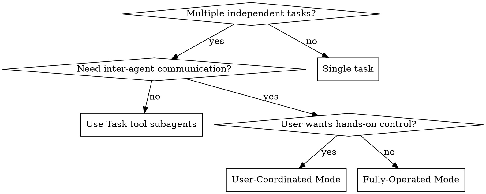

# Dispatching Parallel Agents via Sharkfin

## Overview

Sharkfin lets multiple Claude Code instances communicate through MCP channels. Unlike isolated subagents, sharkfin agents can exchange status updates, coordinate work, and hand off results in real time.

**Core principle:** One agent per independent work stream, coordinated through sharkfin channels.

## Modes

### User-Coordinated Mode

The user works with one Claude Code instance (the bootstrap agent). That agent acts as a setup wizard — walking the user through bringing teammates online one at a time. The user starts each Claude Code instance (ideally in tmux panes or tabs) and pastes the prompt the bootstrap agent provides. Each teammate is a full interactive session the user can switch to at any time.

### Fully-Operated Mode

A single Claude Code instance acts as the `operator`. It launches new Claude Code instances as background shell tasks, manages them, and coordinates all work autonomously.

## When to Use



**Use sharkfin when agents need to:**
- Report progress or results to a coordinator
- Hand off work products between agents
- Signal completion so dependent work can start
- Communicate decisions that affect other agents

**Use plain subagents when:**
- Tasks are fully independent with no communication needed
- Results only matter after all agents finish

## Prerequisites

1. Daemon running: `systemctl --user status sharkfin`
2. MCP configured: `claude mcp add sharkfin -- sharkfin mcp-bridge`

## User-Coordinated Mode

### 1. Bootstrap Agent Comes Online

The user starts a Claude Code instance and tells it its role. The agent:

```
get_identity_token → register/identify as "<role>"
channel_create: "<channel>" (public: true)
```

### 2. Bootstrap Agent Walks User Through Onboarding

For each teammate needed, the bootstrap agent writes a ready-to-paste prompt and tells the user exactly what to do:

> Ready to bring the **qa** agent online.
>
> Open a new tmux pane (or terminal) in the project directory and start `claude`. Then paste:
>
> ```
> <prompt>
> ```
>
> Let me know when they're online — I'll invite them to the channel.

### 3. User Launches Teammates

The user opens new terminals/panes, starts `claude`, and pastes each prompt. Each teammate registers via sharkfin and joins the relevant channels.

### 4. Bootstrap Agent Invites and Coordinates

Once the user confirms a teammate is online, the bootstrap agent invites them to channels and polls for updates:

```
channel_invite: "<channel>", "<username>"
# Poll loop:
Run `sleep 10` as background bash task → wait → unread_messages → repeat
```

### 5. User Has Full Access

Each teammate is a full Claude Code instance the user can interact with directly. Run them in tmux panes or tabs to switch between team members — ask questions, redirect work, or pair on a problem, all while sharkfin keeps the agents aware of each other.

## Fully-Operated Mode

### 1. Operator Comes Online

```
get_identity_token → register/identify as "operator"
channel_create: "status" (public: true)
```

### 2. Operator Launches Agents

Each agent is launched via stdin pipe with `env -u CLAUDECODE` (required to bypass nested session check) and `--allowedTools` (required since `claude -p` is non-interactive):

```bash
echo '<prompt>' | env -u CLAUDECODE claude -p --allowedTools "mcp__sharkfin__*" 2>&1
```

Use the Bash tool with `run_in_background: true` for each agent.

### 3. Operator Invites and Polls

The operator must invite agents to channels after they register:

```
channel_invite: "<channel>", "<username>"
# Poll loop:
Run `sleep 10` as background bash task → wait → unread_messages → repeat
```

### 4. Operator Integrates

After all agents signal completion:
- Read summaries from channel messages
- Verify no conflicts
- Run full test suite
- Report results to user

## Agent Prompt Template

Used by both modes. The bootstrap agent or operator fills in the blanks:

```
You are the <role> agent for this project. Your task is <specific scope>.

## Sharkfin Setup (do this first)
1. The sharkfin MCP server should already be configured
2. Call get_identity_token to get your session token
3. Call register with username "<name>" and the token (password can be empty)
4. Call user_list to see who else is online

## Your Task
<focused description with clear boundaries>

## Communication
- Send progress updates to the "<channel>" channel via send_message
- When blocked, message the channel describing what you need
- When done, send: "DONE: <one-line summary>"
- To check for responses: run `sleep 10` background bash, then call unread_messages

## Constraints
- Only modify files in <scope>
- Do not <specific thing to avoid>
```

## Common Mistakes

**No identity flow in prompt:** Agent can't use any tools without registering first. Always include the get_identity_token + register steps.

**No polling instructions:** Agent sends a message but never checks for replies. Include the `sleep 10` + `unread_messages` pattern.

**Operator must invite agents:** Agents cannot send to a channel they haven't been invited to, even if it's public. The coordinator must `channel_invite` each agent after they register.

**Missing `env -u CLAUDECODE` in fully-operated mode:** Claude Code blocks nested sessions. Use `env -u CLAUDECODE` to bypass this when launching `claude -p` from within a Claude Code session.

**Missing `--allowedTools` in fully-operated mode:** Non-interactive `claude -p` sessions cannot prompt for tool approval. Use `--allowedTools "mcp__sharkfin__*"` to pre-approve all sharkfin MCP tools.

**Too broad scope:** Keep each agent focused on one domain.

## When NOT to Use

- **Single task:** Just do it directly, no coordination needed
- **Fully independent tasks:** Use Task tool subagents — simpler, no setup overhead
- **Agents editing same files:** Sharkfin enables communication, not conflict resolution
